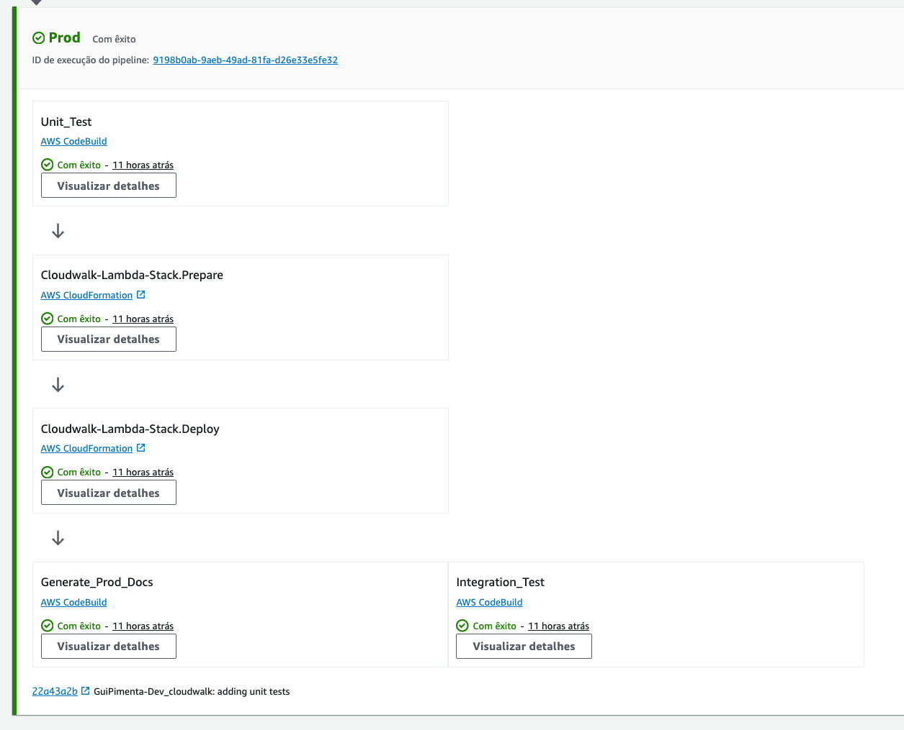

# Cloudwalk Case

This project aims to create a Log parser proposed at [https://gist.github.com/cloudwalk-tests/704a555a0fe475ae0284ad9088e203f1](https://gist.github.com/cloudwalk-tests/704a555a0fe475ae0284ad9088e203f1).

Two versions of the same parser were implemented. One version with Python running on a Lambda Function in AWS and another version running in Node locally on a docker container.

## Python Implementation

The Python version of the case leverages **Lambda Forge**, a custom framework meticulously created by me to speed up Lambda development. Comprehensive documentation for Lambda Forge is accessible [here](https://docs.lambda-forge.com/).

Lambda Forge orchestrates a customizable CI/CD Pipeline on AWS CodePipeline, triggered automatically every time code is pushed to this repository. This pipeline includes pre-deployment unit testing, followed by integration testing, and finally Swagger documentation generation post-deployment.



The source code for the Lambda function resides within `functions/log_parser`.

```
functions
├── __init__.py
└── log_parser
    ├── __init__.py
    ├── config.py
    ├── expected_result.json
    ├── integration.py
    ├── main.py
    ├── quake.txt
    ├── quake_parser.py
    └── unit.py
```

The implementation of the Lambda function itself is encapsulated within `main.py`.

Access the parser Lambda function via the following endpoint:

https://dl60eatoa5.execute-api.us-east-2.amazonaws.com/prod/quake

Access the Swagger Docs via the following endpoint:

https://dl60eatoa5.execute-api.us-east-2.amazonaws.com/prod/docs

To execute unit tests, utilize the following command:

```
pytest -k "unit" .
```

For integration tests:

```
pytest -k "integration" .
```

## Node.js Implementation

The Node.js parser is situated within the `/node` directory.

To deploy and run the Node.js parser, execute the following commands:

```
docker build -t cloudwalk .
docker run -p 3000:3000 cloudwalk
```

Access the endpoint via:

```
http://localhost:3000/games
```

Thank you for your attention!

> Clean code always looks like it was written by someone who cares. <br/>
> -- Michael Feathers
